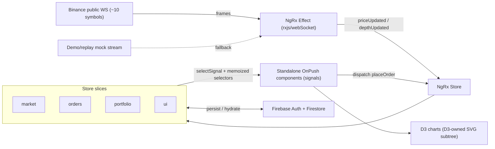
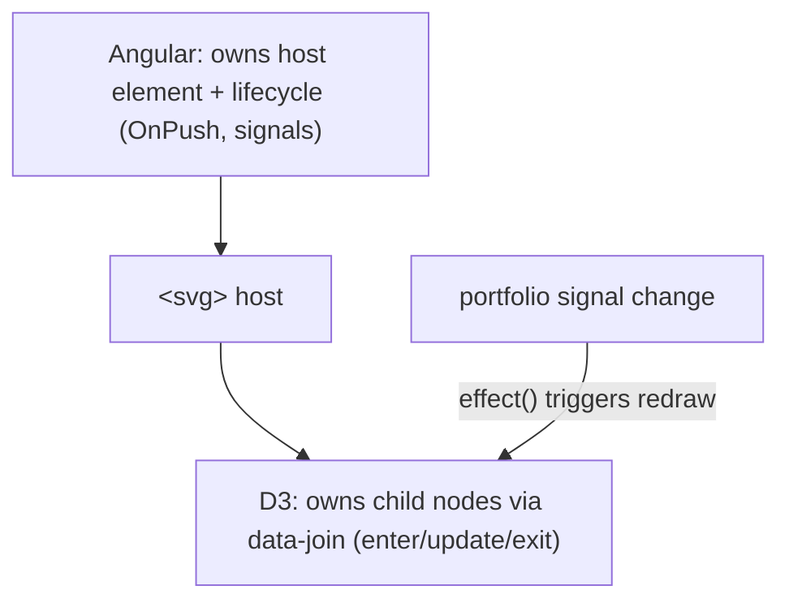

# TradeDesk — Architecture & Technical Design

This document is the technical contract for the build. It covers folder structure, the NgRx state
shape, data flow, and the design of each non-trivial piece (WebSocket Effect, memoized selectors,
`priceFlash` directive, the cross-field validator, the D3/Angular boundary, and demo mode).

---

## 1. High-level data flow



Principles:

- Unidirectional data flow: components dispatch actions; state flows back via selectors-as-signals.
- Components never `subscribe()` manually; they read `selectSignal` outputs or use the `async` pipe.
- Side effects (WS, Firestore) live in Effects/services, never in components.

---

## 2. Folder structure

Single Angular CLI app (no Nx — kept deliberately focused).

```
src/app/
  core/                         # app-lifetime singletons (providedIn: 'root')
    market-data/
      market-socket.service.ts  # owns rxjs/webSocket connection + backoff
      demo-stream.service.ts    # seeded replay stream (offline fallback)
      market-feed.token.ts      # InjectionToken to swap live vs demo
    firebase/
      firebase.providers.ts     # provideFirebaseApp / provideAuth / provideFirestore
      auth.service.ts
      orders.repository.ts      # Firestore read/write for orders
      portfolio.repository.ts   # Firestore read/write for portfolio snapshot
    guards/                     # functional route guards
    interceptors/               # functional HTTP interceptors (if any REST is used)
    error/global-error-handler.ts
  shared/                       # reusable, stateless building blocks
    directives/price-flash.directive.ts
    components/                 # presentational UI (buttons, badges, status pill)
    pipes/
    models/                     # Symbol, Order, OrderType, Holding, ConnectionStatus, ...
  state/                        # NgRx — one folder per slice
    market/    { market.actions.ts, market.reducer.ts, market.selectors.ts, market.effects.ts }
    orders/    { ... }
    portfolio/ { ... }
    ui/        { ... }
    index.ts                    # rootReducers, AppState type, provideStore wiring
  features/                     # lazy-loaded routes (one folder each)
    market-watch/
    order-placement/
    order-book/
    portfolio/
    charts/
    order-history/
  app.config.ts                 # bootstrap providers (zoneless, router, store, firebase)
  app.routes.ts                 # top-level lazy routes
docs/
```

Routing: every feature is `loadComponent`/`loadChildren` lazy, registering its own feature state via
`provideState(...)` and `provideEffects(...)` at the route level where it makes sense (market feed
state can be root-provided since it's shared).

---

## 3. State shape

```ts
interface AppState {
  market: {
    symbols: Record<
      string,
      {
        // keyed by symbol, e.g. "BTCUSDT"
        price: number;
        prevPrice: number; // enables priceFlash direction without component logic
        changePct: number;
        volume: number;
        lastUpdated: number; // epoch ms
      }
    >;
    selectedSymbol: string;
    depth: Record<string, { bids: [number, number][]; asks: [number, number][] }>;
    connectionStatus: 'connecting' | 'open' | 'reconnecting' | 'closed' | 'demo';
  };
  orders: {
    entities: Record<string, Order>; // NgRx entity-style
    ids: string[];
    submitting: boolean;
    lastError: string | null;
  };
  portfolio: {
    cash: number;
    holdings: { symbol: string; qty: number; avgCost: number }[];
    // P&L and allocation are NOT stored — derived via selectors against `market`
  };
  ui: {
    activeRoute: string;
    theme: 'dark' | 'light';
    feedMode: 'live' | 'demo';
    loading: Record<string, boolean>;
    dialog: { kind: 'order-detail' | 'confirm' | null; payload?: unknown };
  };
}
```

Key modeling decisions:

- `prevPrice` is stored in state so the `priceFlash` directive can determine direction declaratively,
  rather than the component diffing values.
- P&L and allocation are **never stored** — they are computed via cross-slice selectors so they can
  never drift out of sync with live prices.

---

## 4. WebSocket Effect pattern

The connection lives in `MarketSocketService`; the Effect maps frames to actions.

```ts
// market.effects.ts (sketch)
connect$ = createEffect(() =>
  this.actions$.pipe(
    ofType(MarketActions.connect),
    switchMap(() =>
      this.feed.stream$().pipe(
        // feed = live socket OR demo stream (DI token)
        map((frame) => MarketActions.priceUpdated({ update: toPriceUpdate(frame) })),
        retry({ delay: (_, n) => timer(backoff(n)) }), // exponential backoff, capped
        takeUntil(this.actions$.pipe(ofType(MarketActions.disconnect))),
        startWith(MarketActions.statusChanged({ status: 'connecting' })),
      ),
    ),
  ),
);
```

Notes that survive interview scrutiny:

- **Effects are app-lifetime singletons.** Teardown is therefore scoped to a `disconnect` action
  dispatched when leaving the route (via route data / a resolver / component `ngOnDestroy`), not to
  the Effect's own destruction (which never happens). `takeUntilDestroyed` is used in services/components
  that own subscriptions, the Effect uses `takeUntil(disconnect$)`.
- **Backoff:** `backoff(n) = min(baseDelay * 2 ** n, maxDelay)` with a max-attempts cap; status pushed
  into `connectionStatus` so the UI can show "reconnecting".
- **Symbol-scoped depth:** the Order Book uses `switchMap` on `selectedSymbol` so selecting a new symbol
  cancels the previous depth subscription — no cross-symbol bleed.

Binance endpoint (combined streams, public, no key):
`wss://stream.binance.com:9443/stream?streams=btcusdt@ticker/ethusdt@ticker/...`

---

## 5. Selector memoization + signals bridge

```ts
// parameterized, memoized per symbol
export const selectSymbol = (symbol: string) =>
  createSelector(selectMarket, (m) => m.symbols[symbol]);

// cross-slice P&L (composition)
export const selectPnl = createSelector(selectHoldings, selectMarketSymbols, (holdings, symbols) =>
  holdings.map((h) => computePnl(h, symbols[h.symbol])),
);
```

In a component (zoneless, OnPush):

```ts
private store = inject(Store);
readonly btc = this.store.selectSignal(selectSymbol('BTCUSDT'));
```

Why this keeps the watchlist fast:

- One memoized selector **per symbol**, so a BTC tick does not invalidate ETH's selected value.
- Each row component reads only its own symbol's signal → only that row's view is marked dirty.
- Verified empirically with a render-count log per row (not assumed from the pattern).

---

## 6. `priceFlash` attribute directive

```ts
@Directive({ selector: '[priceFlash]', standalone: true })
export class PriceFlashDirective {
  private el = inject(ElementRef<HTMLElement>);
  private r = inject(Renderer2);

  @Input('priceFlash') set value(curr: number) {
    /* compare to previous, addClass up/down */
  }
  // remove the class on the 'animationend' event (no setTimeout magic numbers)
}
```

Design rules:

- DOM mutation goes through `Renderer2` (`addClass`/`removeClass`) — never direct `nativeElement` writes,
  so it stays zoneless/SSR-safe.
- The flash resets on the CSS `animationend` event, not a `setTimeout`, so it can't drift or leak timers.
- Direction (up=green/down=red) is derived from the previous value; the directive carries no business logic.

---

## 7. Cross-field validator (Order Placement)

```ts
// FormGroup-level validator
export const conditionalPriceValidator: ValidatorFn = (group) => {
  const type = group.get('orderType')!.value;
  const errors: Record<string, true> = {};
  if (type === 'limit' && !group.get('limitPrice')!.value) errors['limitPriceRequired'] = true;
  if (type === 'stop-loss' && !group.get('stopPrice')!.value) errors['stopPriceRequired'] = true;
  return Object.keys(errors).length ? errors : null;
};
```

- Validator lives at the **FormGroup** level so it can read sibling controls.
- Switching order type back to `market` clears the conditional errors automatically because the
  validator re-runs on every value change; controls are also reset/`updateValueAndValidity()` on type change.
- Submit is disabled when invalid, and the dispatch handler re-guards (`if (form.invalid) return`) so an
  invalid form can never produce an NgRx action.

---

## 8. D3 / Angular DOM-ownership boundary



Rules:

- The chart component creates the `<svg>` once; D3 owns everything inside it.
- An Angular `effect()` watches the relevant signal and calls a `render(data)` that performs a D3
  **data-join** (enter/update/exit) — it never tears down and recreates the whole SVG on every tick.
- No Angular template bindings (`{{ }}`, `*ngFor`) live inside the D3-owned subtree, so the two never
  fight over the same nodes.
- On destroy / symbol switch, D3 `exit().remove()` clears stale nodes — no DOM leaks.

---

## 9. Demo / replay mode

- A `MARKET_FEED` `InjectionToken` resolves to either `MarketSocketService` (live) or `DemoStreamService`
  (seeded, deterministic mock emitting realistic ticks on an interval).
- Mode is driven by `ui.feedMode` and an environment/build configuration (`--configuration=demo`).
- Lets the app demo with zero network dependency (interview-safe), and gives Playwright deterministic data.

---

## 10. Bootstrap providers (sketch)

```ts
// app.config.ts
export const appConfig: ApplicationConfig = {
  providers: [
    provideZonelessChangeDetection(),
    provideRouter(routes, withComponentInputBinding(), withViewTransitions()),
    provideStore(rootReducers),
    provideEffects([MarketEffects, OrdersEffects]),
    provideStoreDevtools({ maxAge: 25, connectInZone: false }),
    ...provideFirebaseProviders(), // app, auth, firestore
    { provide: ErrorHandler, useClass: GlobalErrorHandler },
    {
      provide: MARKET_FEED,
      useFactory: feedFactory,
      deps: [
        /* env */
      ],
    },
  ],
};
```
