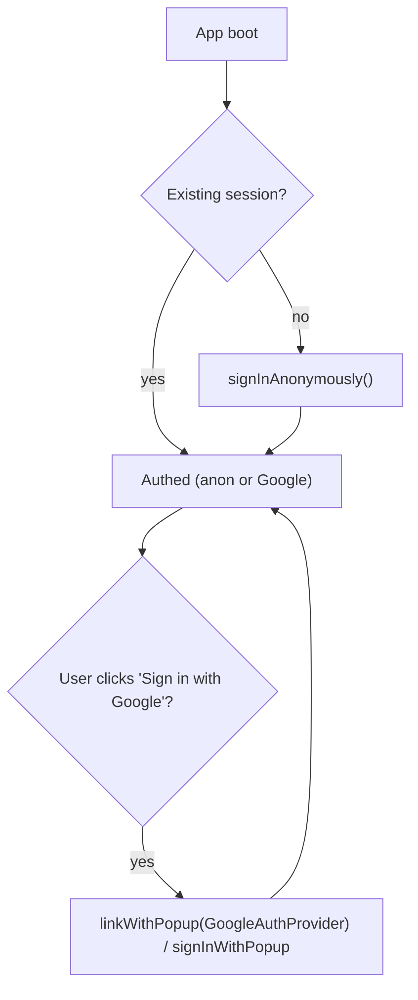
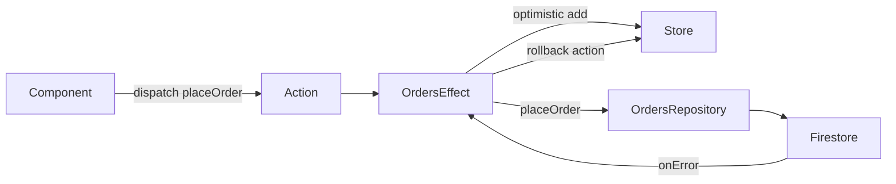

# TradeDesk — Backend (Firebase)

TradeDesk has **no custom server**. The backend is Firebase: **Auth** for identity and **Firestore**
for persisting the user's orders and portfolio snapshot. Everything is wired through `@angular/fire`
(AngularFire) using the modular Firebase JS SDK.

What lives where:

- **Ephemeral (NgRx store only):** live prices, order-book depth, connection status, UI state.
- **Persisted (Firestore):** placed orders and the portfolio snapshot (holdings + cash), scoped to `uid`.

---

## 1. Firebase project setup

1. Create a Firebase project in the console.
2. Enable **Authentication** providers: **Anonymous** (default) and **Google**.
3. Create a **Cloud Firestore** database (production mode — rules below lock it down).
4. Register a Web app; copy the config object into Angular environments
   (`environment.ts` / `environment.demo.ts`). The web config is not a secret, but keep it per-env.

---

## 2. AngularFire wiring (modular providers)

```ts
// core/firebase/firebase.providers.ts
import { initializeApp, provideFirebaseApp } from '@angular/fire/app';
import { provideAuth, getAuth } from '@angular/fire/auth';
import {
  provideFirestore,
  getFirestore,
  initializeFirestore,
  persistentLocalCache,
} from '@angular/fire/firestore';
import { environment } from '../../../environments/environment';

export function provideFirebaseProviders() {
  return [
    provideFirebaseApp(() => initializeApp(environment.firebase)),
    provideAuth(() => getAuth()),
    provideFirestore(() => initializeFirestore(getApp(), { localCache: persistentLocalCache() })),
  ];
}
```

- Offline persistence (`persistentLocalCache`) means the app keeps working and reading cached data
  when the network blips — useful for demos and matching the real-time theme.
- All Firebase access is through injectable services (`Auth`, `Firestore`) via `inject()`.

---

## 3. Auth flow



- **Anonymous-first:** every visitor gets a `uid` immediately, so persistence works with zero friction.
- **Optional Google upgrade:** `linkWithPopup` upgrades the anonymous account (preserving data) where
  possible, falling back to `signInWithPopup`.
- `AuthService` exposes the current user as a signal (`user = toSignal(authState(auth))`) used by guards
  and repositories.

---

## 4. Firestore data model

User-scoped tree — a user can only ever touch their own subtree:

```
users/{uid}
  profile: { displayName?, createdAt, lastSeenAt }

users/{uid}/orders/{orderId}
  { symbol, side: 'buy'|'sell', type: 'market'|'limit'|'stop-loss',
    qty, limitPrice?, stopPrice?, status: 'simulated', createdAt }

users/{uid}/portfolio/snapshot          # single doc holding current snapshot
  { cash, holdings: [{ symbol, qty, avgCost }], updatedAt }
```

Modeling decisions:

- `orders` is a **collection** (append-only history → great fit for CDK virtual scroll, paginated reads).
- `portfolio` is a **single snapshot doc** (overwritten/merged) — cheap to read, no aggregation needed.
- Use **typed Firestore converters** (`withConverter<Order>()`) so reads/writes are strongly typed.
- Writes are **debounced/batched** for the portfolio snapshot to avoid a write per tick.

---

## 5. Security rules

`firestore.rules`:

```
rules_version = '2';
service cloud.firestore {
  match /databases/{database}/documents {

    function isOwner(uid) {
      return request.auth != null && request.auth.uid == uid;
    }

    match /users/{uid} {
      allow read, write: if isOwner(uid);

      match /orders/{orderId} {
        allow read: if isOwner(uid);
        allow create: if isOwner(uid)
          && request.resource.data.status == 'simulated'
          && request.resource.data.qty is number
          && request.resource.data.qty > 0;
        allow update, delete: if false;     // orders are immutable history
      }

      match /portfolio/{docId} {
        allow read, write: if isOwner(uid);
      }
    }
  }
}
```

- Default-deny: nothing is readable/writable unless an owner rule explicitly allows it.
- Orders are **append-only** (no update/delete) — they're a historical record.
- Basic shape validation on order creation (`status == 'simulated'`, positive numeric `qty`).

---

## 6. Repository pattern

- `OrdersRepository` — `placeOrder(order)`, `streamOrders(limit, cursor)` (paged), used by the orders Effect.
- `PortfolioRepository` — `loadSnapshot()`, `saveSnapshot(snapshot)` (debounced).
- Repositories return RxJS/promise APIs; the NgRx **orders/portfolio Effects** call them, keeping
  Firestore access out of components and reducers.



- **Optimistic update:** the order is added to the store immediately, then persisted; a Firestore error
  dispatches a rollback action. This satisfies the "appears immediately" acceptance criterion.

---

## 7. Local emulator (dev)

- Use the **Firebase Emulator Suite** (Auth + Firestore) for local dev and CI so tests never touch prod.
- `firebase emulators:start`; point AngularFire at the emulators when `environment.useEmulators` is true
  (`connectAuthEmulator`, `connectFirestoreEmulator`).
- Playwright E2E runs against emulators + demo feed mode for fully deterministic runs.
