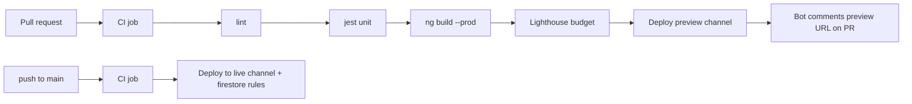

# TradeDesk — Deployment & CI/CD

**Host:** Firebase Hosting (same project as Auth/Firestore — one console, one deploy target).
**Pipeline:** GitHub Actions — lint, unit tests, build, Lighthouse budget, deploy.
**Environments:** production (on `main`) + ephemeral preview channels (per pull request).

---

## 1. Why Firebase Hosting

- Already using Firebase for Auth + Firestore, so hosting keeps everything in one project.
- Global CDN, free TLS, atomic deploys + instant rollback, and built-in **preview channels** for PRs.
- A single-page Angular app maps cleanly to Hosting's SPA rewrite.

---

## 2. Hosting config

`firebase.json`:

```json
{
  "hosting": {
    "public": "dist/tradedesk/browser",
    "ignore": ["firebase.json", "**/.*", "**/node_modules/**"],
    "rewrites": [{ "source": "**", "destination": "/index.html" }],
    "headers": [
      {
        "source": "**/*.@(js|css|woff2)",
        "headers": [{ "key": "Cache-Control", "value": "public, max-age=31536000, immutable" }]
      }
    ]
  },
  "firestore": { "rules": "firestore.rules", "indexes": "firestore.indexes.json" },
  "emulators": {
    "auth": { "port": 9099 },
    "firestore": { "port": 8080 },
    "ui": { "enabled": true }
  }
}
```

- SPA rewrite sends all routes to `index.html` (Angular router takes over).
- Long-cache hashed assets; `index.html` stays uncached so deploys are picked up immediately.

---

## 3. CI/CD pipeline



### Workflow sketch (`.github/workflows/ci.yml`)

```yaml
name: ci
on:
  pull_request:
  push: { branches: [main] }

jobs:
  build-test:
    runs-on: ubuntu-latest
    steps:
      - uses: actions/checkout@v4
      - uses: actions/setup-node@v4
        with: { node-version: 20, cache: npm }
      - run: npm ci
      - run: npm run lint
      - run: npm test -- --ci --coverage
      - run: npm run build
      - run: npm run lighthouse # fails build if budget regresses
      - uses: actions/upload-artifact@v4
        with: { name: dist, path: dist }

  e2e:
    needs: build-test
    runs-on: ubuntu-latest
    steps:
      - uses: actions/checkout@v4
      - uses: actions/setup-node@v4
        with: { node-version: 20, cache: npm }
      - run: npm ci
      - run: npx playwright install --with-deps
      - run: npm run e2e # against demo feed + firebase emulators

  deploy-preview:
    needs: [build-test]
    if: github.event_name == 'pull_request'
    runs-on: ubuntu-latest
    steps:
      - uses: actions/checkout@v4
      - uses: FirebaseExtended/action-hosting-deploy@v0
        with:
          repoToken: ${{ secrets.GITHUB_TOKEN }}
          firebaseServiceAccount: ${{ secrets.FIREBASE_SERVICE_ACCOUNT }}
          projectId: tradedesk
          # no channelId -> preview channel; URL auto-commented on the PR

  deploy-prod:
    needs: [build-test, e2e]
    if: github.ref == 'refs/heads/main' && github.event_name == 'push'
    runs-on: ubuntu-latest
    steps:
      - uses: actions/checkout@v4
      - uses: FirebaseExtended/action-hosting-deploy@v0
        with:
          repoToken: ${{ secrets.GITHUB_TOKEN }}
          firebaseServiceAccount: ${{ secrets.FIREBASE_SERVICE_ACCOUNT }}
          projectId: tradedesk
          channelId: live
```

- **PRs** get an ephemeral preview channel; the action comments the URL on the PR (great for reviewers/recruiters).
- **`main`** deploys to the live channel after unit + E2E pass.
- Firestore rules deploy alongside hosting (`firebase deploy --only firestore:rules`) on prod.

---

## 4. Secrets & config

- `FIREBASE_SERVICE_ACCOUNT` — a service-account JSON stored as a GitHub Actions secret (never committed).
- The Firebase **web config** (apiKey, etc.) is not secret and lives in `src/environments/*` per build configuration.
- Real secrets (service account, any future API keys) never enter the client bundle.
- `.gitignore` excludes service-account files and local `.firebaserc` overrides if needed.

---

## 5. Build configurations

- `production` — live Binance feed, prod Firebase project, optimizer + budgets on.
- `demo` — seeded replay feed, used for the interview-safe public demo and Playwright runs.
- Angular budgets enforced in `angular.json`; Lighthouse CI budget enforced in the pipeline.

---

## 6. Performance budgets (Lighthouse CI)

- Performance >= 90, Accessibility >= 95 on the Market Watch route.
- Initial JS within budget thanks to lazy routes + standalone tree-shaking.
- Budgets are CI gates, not advisory — a regression fails the build.
